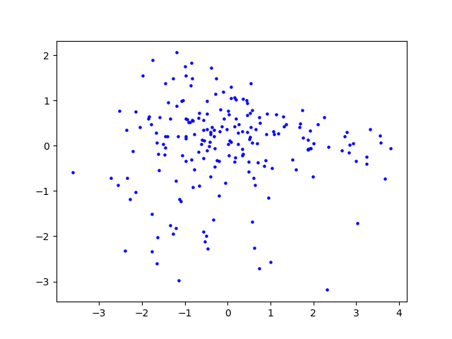

# Principal-Component-Analysis-from-Scratch
## Overview
This project aims to apply dimensionality reduction using PCA. PCA is an algorithm which uses eigenvalue analysis to get the dimensions of the most importance. This helps us in maximising the total retained variance and also reducing dimensions to make our model less complex.

## 1. Applying PCA to visualise the dataset

### 1.1 PCA 2D

First, I reduced the given dataset to 2 dimensions and then 3 dimensions using the PCA class implememnted by me.

### Reducing the dataset to 2 Dimensions:

### Reconstruction error:
$$ ReconstructionError = 0.15484522833637976 $$

### 1.2 PCA 3D
Then we do the same for 3 dimensions.

### Reducing the dataset to 2 Dimensions:

### Reconstruction error:
$$ ReconstructionError = 0.15197906100699912 $$

## 2. Verifying functionality of PCA using check PCA method:
The checkPCA method reconstructs the original dataset using the reduced dataset and the principal components and then checks the reconstruction error to decide whether the dimensionality reduction is happening correctly.
### Formula for reconstructing the dataset
$$ X_{reconstructed} = (X_reduced, components^T) + mean_vec $$
### Formula for reconstruction error
$$ reconstruction_error = np.mean(np.abs(originaldDataset - reconstructedDataset)) $$

## 3. Scree plot and optimum dimensions for reduction

The point of the scree plot is to know how many dimensions to consider so that most amount of information of our dataset is retained.

### Scree plot:

Here, we see that somewhere aruond the value 100 or a little higher, the addition of information is very less, so increasing the dimensions beyond that point isn't worth the tradeoff between complexity of our model and the information retained.

### Optimal number of dimensions:
$$ Dimensions_{optimum} = 100 $$

Then I applied PCA on the dataset and reduced the dimensions to 100.